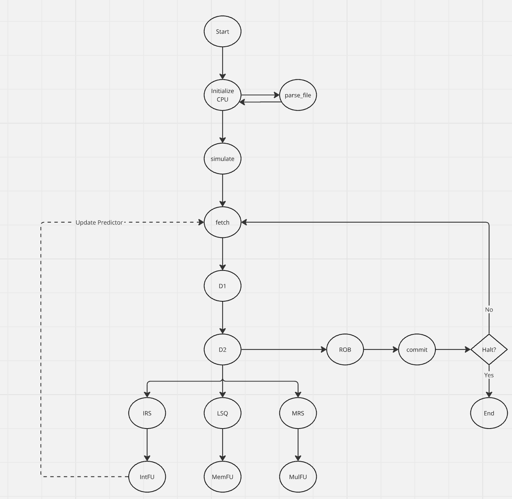

# Design Document - Apex CPU Simulator (Draft 2)

## Struct: CPU

**Fields:**
- `UCRF` (int[10]): Array holding the values of user control registers.
- `UPRF` (int[60]): Array holding the values of user program registers.
- `Rename Table` (int[]): Array mapping architectural registers to physical registers for renaming.
- `Free List` (int[]): Array of available registers for renaming.
- `Forwarded Registers` (int[]): Copy of `UCRF` and `UPRF` to store forwarded register values.
- `Forwarded Register Validity` (bool[]): Array indicating the validity of forwarded registers.
- `Data Memory` (int[]): Array representing the data memory.
- `Program Counter (PC)` (int): Current instruction pointer.
- `Clock Cycles` (int): Tracks the number of clock cycles in the simulation.
- `Code Memory` (Instruction[]): Array representing the program code.
- `Stalled?` (bool): Flag indicating if the CPU is stalled due to pipeline hazards.
- `UPRF Locks` (semaphore[]): Array of semaphores indicating the lock status of each entry in the `UPRF`.
- `UCRF Locks` (semaphore[]): Array of semaphores indicating the lock status of each entry in the `UCRF`.
- `IRS` (IQE[]): Queue for integer instruction reservation stations.
- `LSQ` (IQE[]): Queue for load/store operations.
- `MRS` (IQE[]): Queue for multiply operations.
- `ROB` (IQE[]): Queue for the reorder buffer managing instruction completion and commit.
- `Fetch` (CPU_STAGE): Represents the state of the fetch stage.
- `D1` (CPU_STAGE): Represents the state of the first decode stage.
- `D2` (CPU_STAGE): Represents the state of the second decode stage.
- `Int FU` (CPU_STAGE): Represents the state of the integer functional unit.
- `MUL FU` (CPU_STAGE): Represents the state of the multiplication functional unit.
- `MEM FU` (CPU_STAGE): Represents the state of the memory functional unit.
- `Commit` (CPU_STAGE): Represents the commit stage.
- `Predictor Queue` (PQE[]): Holds entries for control flow instructions for branch prediction.
- `Return Stack` (RSE[]): Stores return addresses for function calls.

**Associated Functions:**
- **Parse File**
  - **Description**: Parses the assembly code from a given file and returns an array of instructions.
  - **Arguments**: `char* filename` — The name of the assembly code file.
  - **Return**: `Instruction[]` — Array of parsed instructions.
  
- **Simulate**
  - **Description**: Simulates the execution of instructions on the CPU through the pipeline stages.
  - **Arguments**: `cpu* cpu` — The current state of the CPU.
  - **Return**: `void`
  
- **Fetch**
  - **Description**: Fetches instructions from memory and queues them for processing.
  - **Arguments**: `cpu* cpu` — The current state of the CPU.
  - **Return**: `void`
  
- **Decode (D1)**
  - **Description**: Decodes the instruction and performs register renaming. If the instruction is a branch or a control flow instruction, it is added to the predictor queue.
  - **Arguments**: `cpu* cpu` — The current state of the CPU.
  - **Return**: `void`
  
- **Decode (D2)**
  - **Description**: Forwards the decoded instruction to the appropriate reservation station or reorder buffer.
  - **Arguments**: `cpu* cpu` — The current state of the CPU.
  - **Return**: `void`
  
- **IRS (Integer Reservation Station)**
  - **Description**: Checks for register availability and forwards the instruction to the integer functional unit.
  - **Arguments**: `cpu* cpu` — The current state of the CPU.
  - **Return**: `void`
  
- **LSQ (Load/Store Queue)**
  - **Description**: Similar to IRS, but for load/store operations, forwarding instructions to the memory functional unit.
  - **Arguments**: `cpu* cpu` — The current state of the CPU.
  - **Return**: `void`
  
- **MRS (Multiply Reservation Station)**
  - **Description**: Similar to IRS, but for multiply operations, forwarding instructions to the multiply functional unit.
  - **Arguments**: `cpu* cpu` — The current state of the CPU.
  - **Return**: `void`
  
- **Int FU (Integer Functional Unit)**
  - **Description**: Executes integer instructions (e.g., ADD, SUB).
  - **Arguments**: `cpu* cpu` — The current state of the CPU.
  - **Return**: `void`
  
- **MUL FU (Multiplication Functional Unit)**
  - **Description**: Executes multiplication operations.
  - **Arguments**: `cpu* cpu` — The current state of the CPU.
  - **Return**: `void`
  
- **MEM FU (Memory Functional Unit)**
  - **Description**: Executes memory load/store operations.
  - **Arguments**: `cpu* cpu` — The current state of the CPU.
  - **Return**: `void`
  
- **ROB (Reorder Buffer)**
  - **Description**: Tracks instruction completion and commits them when ready.
  - **Arguments**: `cpu* cpu` — The current state of the CPU.
  - **Return**: `void`
  
- **Commit**
  - **Description**: Commits completed instructions to the register file or memory.
  - **Arguments**: `cpu* cpu` — The current state of the CPU.
  - **Return**: `bool` — Indicates whether the simulation has finished.

---

## Struct: Instruction

**Fields:**
- `Opcode (str)` (string): String representation of the instruction's opcode (e.g., "ADD", "SUB").
- `Opcode (int)` (int): Integer value corresponding to the opcode.
- `Rd` (int): The destination register index.
- `Rs1` (int): The first source register index.
- `Rs2` (int): The second source register index.
- `Rs3` (int): The third source register index (optional).
- `Imm` (int): The immediate value (if applicable).

**Associated Functions:**
- **None** — This is a simple data structure for holding an instruction's data.

---

## Struct: IQE (Instruction Queue Entry)

**Fields:**
- `Opcode` (int): Integer value representing the instruction's opcode.
- `Rd` (int): The destination register.
- `Rs1, Rs2, Rs3` (int): Source registers.
- `Imm` (int): Immediate value.
- `Rd_value, Rs1_value, Rs2_value, Rs3_value` (int): Actual values of the registers.
- `Completed` (bool): Indicates if the instruction has completed execution.
- `Rename Table` (int[]): Current state of the register renaming table.
- `Free List` (int[]): Current state of the free list of registers.
- `Forwarded Registers` (int[]): Current state of the forwarded register file.
- `Forwarded Register Locks` (bool[]): Current state of the forwarded register locks.
- `Predictor Queue` (PQE[]): Current state of the branch predictor queue.
- `Return Stack` (RSE[]): Current state of the return stack.

**Associated Functions:**
- **None** — This is a data structure used for storing instruction entries in queues.

---

## Struct: PQE (Prediction Queue Entry)

**Fields:**
- `PC` (int): The address of the control flow instruction.
- `Type` (string): The type of control flow instruction (e.g., Branch, JALP, RET).
- `Next_PC` (int): The predicted next instruction address.

**Associated Functions:**
- **None** — Used for storing control flow prediction information.

---

## Struct: RSE (Return Stack Entry)

**Fields:**
- `Return Address` (int): The address to return to after a function call.

**Associated Functions:**
- **None** — Used for storing return addresses.

---

## Struct: CPU_STAGE

**Fields:**
- `Has Instruction` (bool): Flag indicating if there is an instruction in the stage.
- `Entry` (IQE): The instruction entry currently in the pipeline stage.

**Associated Functions:**
- **None** — This is a simple data structure for holding the state of a CPU pipeline stage.

---

## Additional Features

### Instruction Flushing

**Description**: If necessary, instructions are flushed from the pipeline due to mispredictions or hazards. The reorder buffer (ROB) removes instructions after the flush point, and the CPU resets relevant structures like the rename table, free list, and forwarded registers. The program counter is updated to the correct address, ensuring accurate simulation.

---

## Flow diagram of functions

